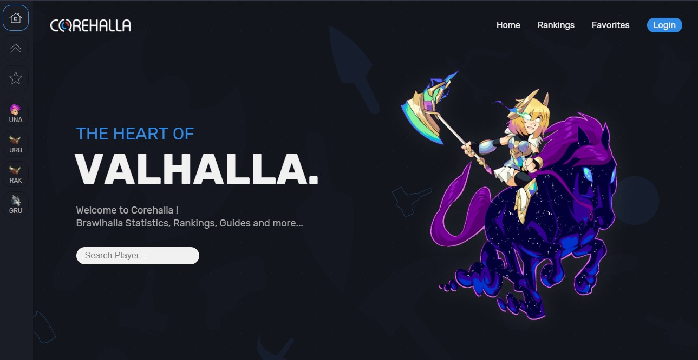
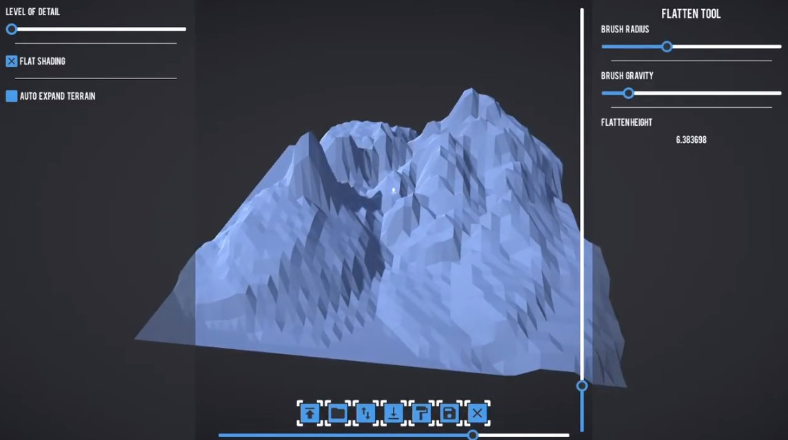

# Hi there 👋, i'm Djobbo!

## 🎸 Who Am I?

I'm a 21yo self taught fullstack web developer.

I started programming at 11yo by making [Minecraft](https://minecraft.net) mods,
and server plugins.

I then developed small games using [Unity](https://unity.com) and C# and used to
post all that stuff on twitter as [@Ludopod](https://twitter.com/ludopod).

I started web development when I was in high school, building small websites
using HTML, CSS and JavaScript. I then discovered JS frameworks and fell into
the rabbit hole.

I also dabbled with some lower level languages like C/C++ & assembly but I'm not
fluent at all, but it's fun from time to time.

## 📚 What I'm currently studying

I've been learning the inner workings of cryptocurrencies, blockchains &
solidity for the past few weeks. Gonna try and launch an app built on
[Ethereum](https://ethereum.org/) soon™.

## 💻 The tech I know and love

**Languages**  


**Frameworks and Libraries**


**Softwares**


**Other**


## 👨‍💻 What I'm working on

### 📈 Corehalla

A statistics and rankings website for the game
[Brawlhalla](https://brawlhalla.com).

#### V1

[](http://corehalla.com)

Current version is closed source and was written using the following stack:

**Frontend**: HTML, CSS, Javascript, JQuery  
**Backend**: NodeJS, Express, EJS

#### V2 aka **Corehalla Neue**

New version is still in active development. It is fully open source, under the
MIT license.

[](https://neue.corehalla.com)
[](https://corehalla-neue.vercel.app/)



Technologies used are the following:

**Frontent**: React, NextJS, SASS/SCSS, Framer Motion  
**Backend**: NodeJS, NextJS Serverless Functions, Firebase Auth, Firestore

[](https://github.com/AlfieGoldson/CorehallaNeue)

### 🎩 Mokap.js

A simple mocking api to quickly create complex data structures in javascript and
typescript.

```ts
import { mock, map, bool, str, num, arr } from 'mokapjs';

const projectGenerator = map({
    // Generates random boolean
    isOpenSource: bool

    // Generates random string using Regex
	name: str(/[A-Z][a-z]{4,10}_[0-9]*/),

    // Generate Number between 0 and 20
	stars: num(0, 20),

    // Chooses between the two options
	author: choice('Alfie', 'Djobbo'),
});

// Generator will create an array of 10 projects when called
const projectsGenerator = arr(projectGenerator, 10);

const projects = mock(projectsGenerator);

// Possible Output
// projects: [
//     {
//         isOpenSource: true,
//         name: 'Mokapjs_03',
//         stars: 18,
//         author: 'Alfie'
//     }
//     ... // 9 More
// ]
```

[](https://github.com/AlfieGoldson/Mokap)

## 🕑 Past Projects

### Landshape

The largest project I ever made with [Unity](https://unity.com)/C#. It is a 3D
Low Poly Map and Tree Editor called Landshape.



You can see watch the demo here:  
[Terrain Editor](https://www.youtube.com/watch?v=tz9Gzjl_mS0)  
[Tree Editor](https://www.youtube.com/watch?v=QwkU8khU_sM)

### 🛒 Nexaur

A shopify theme built using the liquid programming language.

[](https://github.com/AlfieGoldson/Nexaur)

## 📝 My Github Stats

[](https://github.com/anuraghazra/github-readme-stats)


